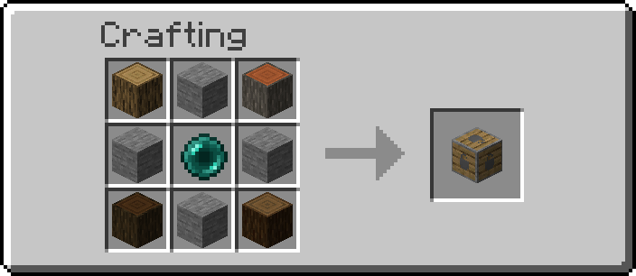
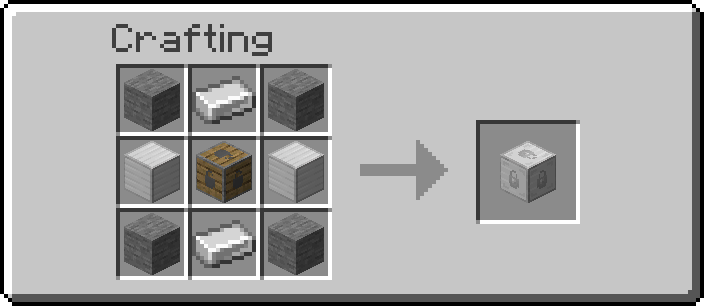
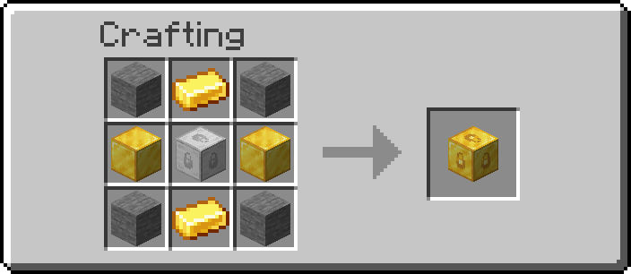
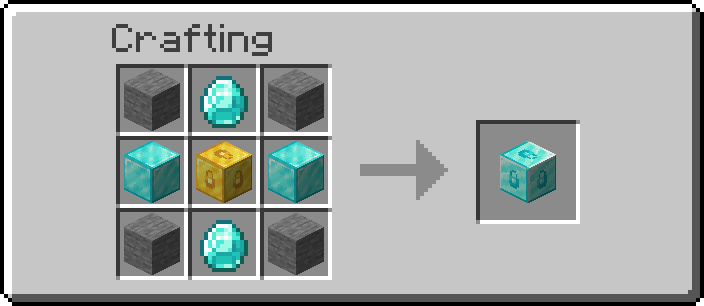
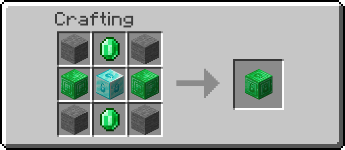
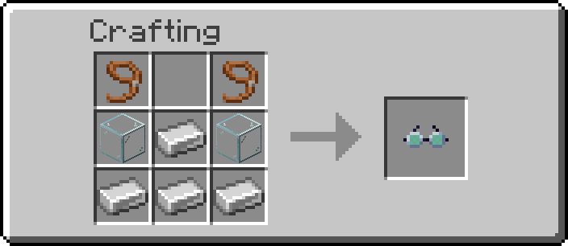

# Get Off My Lawn

*Get Off My Lawn* is a take on the popular concept of claims. It helps protect your stuff! It is built for [Fabric](https://fabricmc.net/use/) on 1.15.2.

**To get started**, you'll have to craft a *Claim Anchor*. Each anchor has a different claim radius; after placing one, a box around it will be formed. This box is yours!

**Makeshift**, radius of 10



**Reinforced**, radius of 25



**Glistening**, radius of 50



**Crystal**, radius of 75



**Emeradic**, radius of 125



**Withered**, radius of 200


[NYI] **To configure your claim**, you can interact with the anchor block. A UI will appear that offers several configuration options:
- The general settings tab can be used to define blanket permissions for non-specified players.
- The player list can be used to define permissions for individual players

[NYI] **To upgrade your claim**, place an Anchor Augment next to the core Claim Anchor. Anchor Augments available include:
- Creeper Explosion Nullifier: Prevents Creeper explosions from damaging terrain
- Ender Binding: Prevents Enddermen from teleporting
- Villager Core: Prevents Zombies from damaging Villagers
- Missile Defense: Shoots trespassers in range
- Visitor Greeter: MOTD to visitors
- Trespasser Alarm: Alert when non-whitelisted people enter the claim
- Angelic Aura: Regen to all players inside region
- Withering Seal: Prevents wither status effect
- Forceful Ejection: non-whitelisted players get launched out of the claim
- Heaven's Wings: flight
- Lake Spirit's Grace: water breathing, water sight, and better breathing
- Defender's Right: pets & golems do 100% more damage to hostile mobs
- Chaos Zone: Strength to all players inside region

**To see claim areas**, you'll have to craft a *Goggles of (Claim) Revealing*:



When this item equipped in the helmet slot, claim outlines become visible. 

## Protection Checks

*Get Off My Lawn* currently checks for claims when the following actions occur:
- Player block break
- Player block interaction
- Player entity damage
- Player entity interaction
- TNT explodes

If the player does not own the claim, they are not allowed to finish (/start) the action. In the case of explosions, no blocks break.

## Installation: Users

You'll need to install the [Fabric Loader](https://fabricmc.net/use/), [Fabric API](https://www.curseforge.com/minecraft/mc-mods/fabric-api/files), and appropriate mod jar from the releases tab (or the CurseForge page).

Drop the mod jar and Fabric API into your `/mods` folder and boot up the game. 

## Installation: Developers

[NYI] *Get Off My Lawn* offers an API that allows you to:
- Check areas for claims
- Add custom Anchor Augments

To install the mod to your development environment:
 
`build.gradle`
```groovy
repositories {
    maven { url 'https://jitpack.io' }
}
```

`build.gradle`
```groovy
dependencies {
    modImplementation 'com.github.Draylar:get-off-my-lawn:${project.goml_version}'
}
```

`gradle.properties`
```groovy
goml_version=master-SNAPSHOT
```

## License

*Get Off My Lawn*  is available under the MIT license. The project, code, and assets found in this repository are available for free public use.
